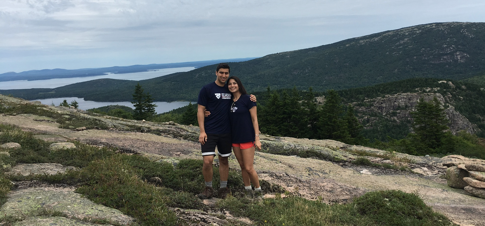
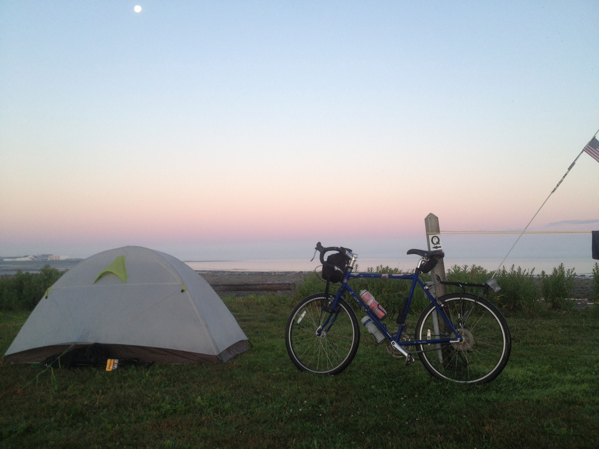

<h2>About Me</h2>

I grew up in the small and scenic town of Williamstown, Massachusetts. Maybe because of the large amount of green open space, I came to love all things outdoors. I attended Mt. Greylock Regional High School, where I captained soccer, tennis, and cross-country ski teams.

After graduating, I left Williamstown for New Haven, Connecticut and Yale. Playing sports quickly became an important part of my college life, though not at the varsity level. I joined a club soccer team that allowed me to keep playing competitively and left me with enduring frienships. I enthusiastically represented my residential college, Branford, in nearly every intramural sport, from basketball to badminton.

Beyond sports, I love to hike and to ride my bike. For two summers in college, I led bike tours for a company called <a href="https://overlandsummers.com/" target="_blank">Overland</a>. I spent these idyllic summers with a co-leader and twelve teenagers, first in Cape Cod, then in Nova Scotia, We rode from campground to campground, bringing only what we could carry on the back of our bikes. Below are two of my favorite pictures from Nova Scotia (click images for full size versions).

	

		
	

	

		
	

At Yale, I chose to major in physics and economics. I became excited about the ways physics (and other STEM disciplines) can contribute to technology that will make the world a better place. I decided that medicine, and an MD-PhD, provide an ideal environment to use STEM to improve people's lives.

It has now been around two years since I graduated, and I've been busy preparing for medical school. Working in applied physics research at MIT Lincoln Laboratory has given me skills that I am eager to use in an MD-PhD. At Lincoln Lab, I've been given great mentors and exciting research projects (read about them <a href="research">here</a>).

Now that I've finished taking post-bac classes, studying for the MCAT exam, and writing all of my applications, I'm excited for what the future holds!

*&nbsp;&nbsp;&nbsp;&nbsp;&nbsp;*&nbsp;&nbsp;&nbsp;&nbsp;&nbsp;*

A recent copy of my resume can be found below.

<h6><a href="Resume_JonahMajumder.pdf" target="_blank">2019 Resume</a></h6>