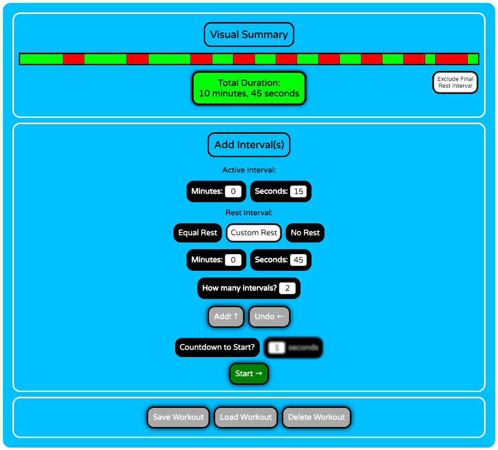

<h2>Projects</h2>

<h4>Programming is one of my favorite hobbies. Here are some of my most recent programming endeavors.</h4>

<ul>
	<li>
This website! I've taken advantage of Github's free website hosting to create this, and I've incorprated a Jekyll theme for the styling.
</li>
	<li>
		

			
As someone who tries to exercise regularly, I found myself lacking a (free) app to precisely schedule the timing of my workouts. So I decided to build a web app to do exactly this, allowing the user to plan out every individual active and rest period. <a href="https://jonahmajumder.github.io/interval-timer">Check it out!</a>

		

		
	</li>
	<li>
		

Studying for the MCAT is tough, but I find that making and testing myself with flashcards is the most effective way to internalize information. Harnessing the power of Python and <a href="https://www.qt.io/developers/">Qt</a>, I've developed a macOS application called "Flash" to parse defintion text files and test a user on anything from sociology to physics. It definitely made a difference for me! The Python source code is <a href="https://github.com/jonahmajumder/flash">here.</a>

			

	</li>
	<li>
		My latest project, a mobile-compatible web app Tetris game. Test your skills <a href="https://jonahmajumder.github.io/webtetris">here</a>!
	</li>
</ul>

