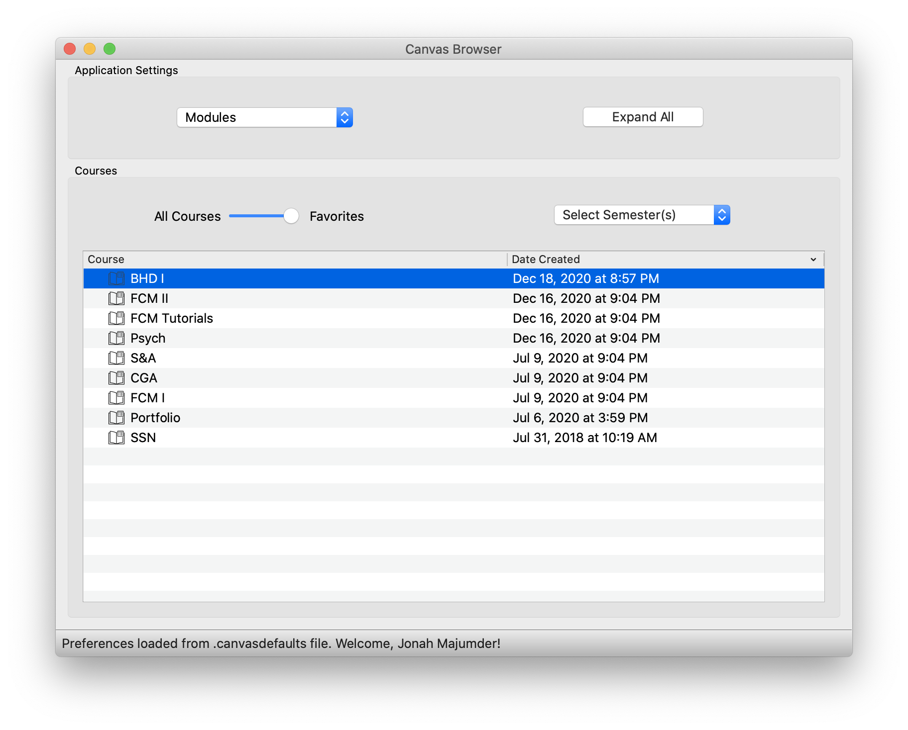

<h2>Projects</h2>

<h4>Programming is one of my favorite hobbies, and here are some highlights. The rest can be seen on my <a href="https://github.com/jonahmajumder" target="_blank">github page</a>!</h4>

<ul>
    <li>
My most recent project is a MacOS desktop application to access course data on any school's Canvas web platform. The application makes calls to the Instructure/Canvas HTTP API and is intended to make interacting with Canvas easier. You can read more (and try it yourself) <a href="https://github.com/jonahmajumder/canvasgui">here</a>! Below is a preview of the application in action.

     
    
     
    </li>
	<li>
This website! I've taken advantage of Github's free hosting to create this, and I've incorprated a Jekyll theme for the styling. Source code <a href="https://github.com/jonahmajumder/jonahmajumder.github.io">here</a>.
</li>
	<li>
		After years of frustration with Preview's inability to bookmark PDF files, I stumbled upon a handy Python <a href="https://pythonhosted.org/PyPDF2/">package</a> for manipulating PDFs. I combined this functionality with PyQt and made a GUI to manipulate and bookmark PDFs. Find it on github <a href="https://github.com/jonahmajumder/bookmarker">here</a>.
		 
		
		 
		Now I can bookmark PDFs to my heart's content for free!
	</li>
	<li>
		

			
As someone who tries to exercise regularly, I found myself lacking a (free) app to precisely schedule the timing of my workouts. So I decided to build a web app to do exactly this, allowing the user to plan out every individual active and rest period. <a href="https://jonahmajumder.github.io/interval-timer">Check it out!</a>

		

		
	</li>
	<li>
		

Studying for the MCAT is tough, but I find that making and testing myself with flashcards is the most effective way to internalize information. Harnessing the power of Python and <a href="https://www.qt.io/developers/">Qt</a>, I've developed a macOS application to parse defintion text files and test a user on anything from sociology to physics. It definitely made a difference for me! The Python source code is <a href="https://github.com/jonahmajumder/flash">here.</a>

			

	</li>
	<li>
		A mobile-compatible web app version of Tetris. Test your skills <a href="https://jonahmajumder.github.io/webtetris">here</a>!
	</li>
</ul>

