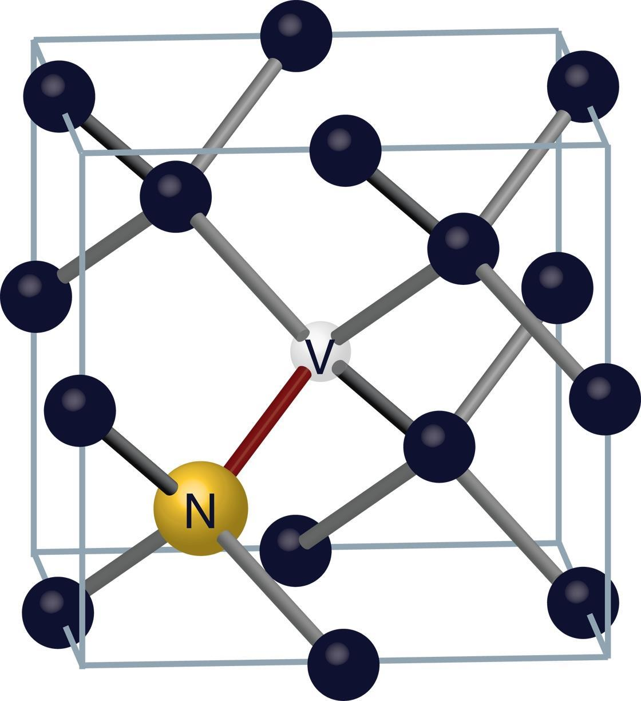

<h2>Research</h2>

<h4>Quantum Sensing at MIT Lincoln Laboratory</h4>

For the past couple years, I've worked as an assistant staff scientist at MIT Lincoln Laboratory, in the <a href="https://www.ll.mit.edu/r-d/advanced-technology/quantum-information-and-integrated-nanosystems" target="_blank">quantum information group</a>.

My research team focuses on what we call quantum sensing. The abstract of a 2017 review paper gives a nice description of quantum sensing:

	"Quantum sensing" describes the use of a quantum system, quantum properties or quantum phenomena to perform a measurement of a physical quantity. ... The field is expected to provide new opportunities - especially with regard to high sensitivity and precision - in applied physics and other areas of science.

	<a href="https://journals.aps.org/rmp/abstract/10.1103/RevModPhys.89.035002
	" target="_blank">
	C. L. Degen, F. Reinhard, and P. Cappellaro, Reviews of Modern Physics <strong>89,</strong> (2017).</a>
	<a href="https://arxiv.org/abs/1611.02427" target="_blank">(arXiv)</a>

	

		
Though many quantum systems have proven useful for sensing, our system of choice is the <a href="https://en.wikipedia.org/wiki/Nitrogen-vacancy_center" target="_blank">nitrogen-vacancy center</a> in diamond. The nitrogen-vacancy (NV) center is an atomic defect in the tetrahedral carbon lattice of diamond. Nitrogen-vacancy centers have been studied extensively over the last twenty years or so. Due to their exquisite sensitivity to external magnetic fields, NVs are promising platforms to develop ultra-sensitive magnetometers.

	

	
	

	
Cartoon image of an NV center.

	

As an MD-PhD hopeful, I'm interested in how NV-based magnetometers could enhance medical imaging and diagnostic tools. One such application is the detection of biological magnetic fields arising from neural activity (see <a href="https://en.wikipedia.org/wiki/Magnetoencephalography" target="_blank">magnetoencephalography</a> and <a href="https://en.wikipedia.org/wiki/Magnetocardiography" target="_blank">magnetocardiography</a>). These magnetic fields are so weak that quantum sensors (so-called <a href="https://en.wikipedia.org/wiki/SQUID" target="_blank">SQUID magnetometers</a>) have always been required to clearly resolve them. Biomagnetometry has become a useful clinical tool, but access is severely limited by cost and lack of portability. We envision that NV-based magnetometers could someday replace current sensors to make diagnostic tools like these more portable and affordable.

I recently presented a poster on the use of NV-based magnetometers in biomagnetometry at the Gordon Research Conference on Quantum Control of Light and Matter. Check it out below.

<h6><a href="GRC Poster 2019.pdf" target="_blank">High-Sensitivity Magnetometry with Nitrogen-Vacancy Centers for Biomagnetic Signal Detection
</a></h6>

<h4>Molecular Cooling at Yale</h4>

As an undergraduate at Yale, I worked in the lab of <a href="https://demillegroup.yale.edu/">Professor Dave DeMille</a>. Professor DeMille's group pioneers the cooling and trapping of diatomic molecules, a feat made difficult by the complex energy level structure of molecules. I built software and hardware to deliver microwave signals to these molecules and precisely manipulate their states. Below is a link to a thesis-like final report I wrote.

<h6><a href="DeMille PHYS472 Report.pdf" target="_blank">The Nuclear Schiff Moment in 205TlF:
Microwave Generation and Implementation
</a></h6>

